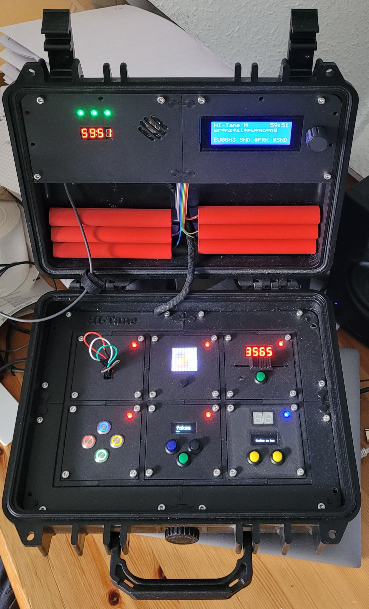
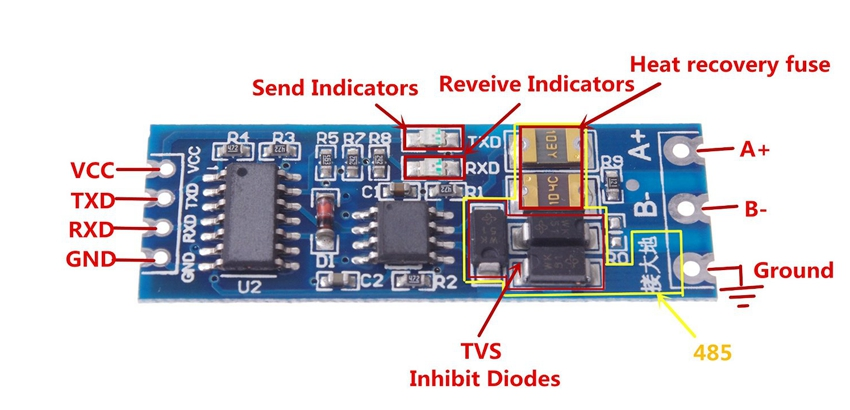
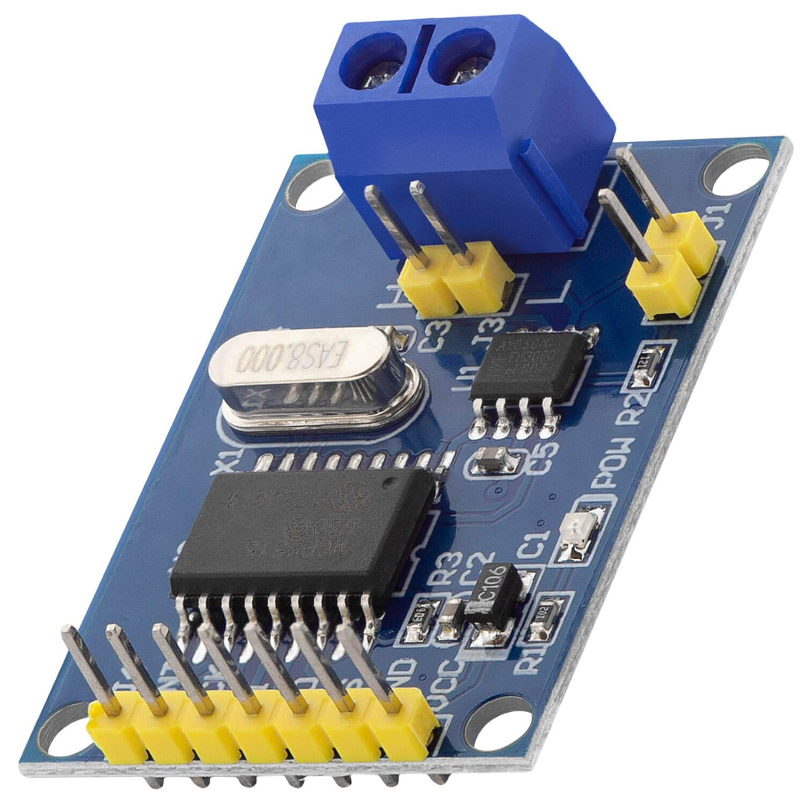

# hi-tane
hardware implementation of the game "keep talk and nobody explodes"

sorry, german only

Hier beschreibe ich die Entwicklung meiner Hardware variante des Spiels "keep talk and nobody explodes". Eingebaut in einen kleinen Koffer. 
Ziel dieses Spiels ist eine "Bombenentschärfung".  Das ganze ist als Geburtstagsgeschenk an meine Frau gedacht. 

# Einleitung

*Der dumpfe Knall der zuschlagenden Tür hallte durch den kleinen verlassenen Lagerraum – Bob war eingeschlossen. Im schwachen Licht der flackernden Glühbirne sah er den Koffer mit der Bombe in der Mitte des Raums: ein wirres Geflecht aus Drähten, LEDs, Knöpfen und Displays und ein unheilvoll tickender Timer. Draußen durchsuchten Justus und Peter verstaubte Regale, bis sie endlich ein vergilbtes Handbuch fanden – die einzige Hoffnung, Bob lebend hier rauszubekommen. Ihre Stimmen knisterten über das Walkie-Talkie: „Bob, hör gut zu. Wir haben die Anleitung. Du musst uns genau beschreiben was du siehst und dann das tun, was wir sagen – und zwar schnell.“ Der Countdown läuft.*

# Hardware

## Basis

Das Spiel ist eigentlich im original ein Handy Spiel, ich habe aber dieses schöne Repository auf github gefunden, dass mir ein klein wenig als Stütze dient. https://heathbar.github.io/keep-talking/

Aufgebaut besteht das Spiel aus einem zentralen Controller, der die Steuerung der Module und die Zeitmessung übernimmt. Nebenher zählt er auch die Fehlversuche. Die einzelnen Module sind als eigenständige Einheiten aufgebaut, die über ein Bussystem mit dem zentralen Controller kommunizieren.

Folgende Module sind geplant:

- 6x6 Maze: finde den Weg zum Ausgang
- Wires: entferne die richtigen Kabel
- Simon says: ähnlich unserem Senso
- Password: finde das richtige Passwort
- Morse: Höre und Antworte
- Needy Gas: ein Modul was ab und zu mal etwas Aufmerksamkeit benötigt
- Symbols: Ordne die Symbole

## Kommunikation

Wie schon weiter oben beschrieben, alle Module und der Controller kommunizieren miteinander. Die Kommunikation basiert auf Nachrichten, die zwischen den Modulen ausgetauscht werden. Da alle Module sowohl untereinander wie auch zentral mit dem Controller kommunizieren müssen, bietet sich ein Bussystem an. Jeder Beteiligte kann über diesen Bus Nachrichten senden und empfangen. Soweit die Theorie. Zunächst einmal welche Nachrichten werden ausgetauscht:

- Heartbeat: Während des Spieles sendet der Controller regelmäßig eine Heartbeat Message. Dieses enthält die aktuelle Zeit und die bereits registrierten Strikes.
- Ambientsettings: diese Message sendet der Controller allen Modulen. Sie enthält Einstellungen für das Spiel, wie z.B. Helligkeit, Farben usw.
- Gamesettings: ebenfalls eine Nachricht des Controllers an alle Module, enthält wichtige Spieleinstellungen: Schwierigkeitsgrad, Seriennummer, Tags, Batterien
- Initialisation: der Controller sendet an jedes mögliche Modul einzeln eine Nachricht zur Initialisierung. Das Modul antwortet darauf und der Controller kann damit eine Liste der Module erstellen.
- Error: falls bei einem Modul ein Fehler aufgetreten ist, kann es diesen über diese Meldung an den Controller übermitteln
- State: Das Modul übermittelt seinen neuen Status an den Controller: z.B. wenn das Rätsel gelöst wurde.
- Strike: Das Modul übermittelt hiermit, wenn eine fehlerhafte Eingabe erfolgt ist.
- Modulinit: Antwort des Modules auf die Initialisation Meldung
- Beep: Das Modul sendet diese Meldung an den Controller, wenn dieser einmal piepen soll.

Nachdem wir nun wissen, was so alles an Nachrichten ausgetauscht werden soll, ging es an die Auswahl des Busses. Dabei gibt es verschiedenen Möglichkeiten. Da ich ein Freund von KISS bin (keep it simple smart), habe ich zunächst mit den verschiedenen Möglichkeiten, die der Controller selber bietet, gespielt.

Zunächst aber ein paar Umgebungsfaktoren

- Einfache Handhabung auf der Hardwareseite. Am besten wären da 1 oder 2 Leitungen als Bus. Das macht die Verkabelung im Koffer einfacher. 
- Einfaches API, d.h. ich hätte gerne nur wenig auf der Softwareseite zu programmieren. Nanos haben nun mal auch wenig Platz, 32KB Flash, 2KB RAM das ist z.B. für einen kompletten TCP-Stack zu wenig. 
- Wenig CPU Ressourcen, optimal steuert sich die Kommunikationsschnittstelle selber, ohne das auf der CPU Seite viel Ressourcen verbraucht werden. 

Nun welche einfachen Bussysteme im klassischen Arduino Universum gibt es denn so:

### USB

USB, ja klar, jeder Nano hat ja bereits ein USB Interface eingebaut, zwar ist das "nur" ein Übersetzer der seriellen Schnittstelle auf USB, aber das wäre schon da. Und die serielle Kommunikation ist recht simple im Arduino implementierbar. 

Nachteil: Man braucht ein Gegenüber, d.h. einen USB Host, der dann auch noch die ganzen vielen virtuellen seriellen Schnittstellen verwaltet. Jedes Modul würde dann auf Hostseite eine serielle Schnittstelle erzeugen. Es gibt ja einen zentralen Controller, der müsste dann aber z.B. in einem Raspberry PI oder was ähnliches implementiert werden. Ein simpler Nano reicht da leider nicht aus. 

Und USB ist kein wirkliches BUS System, da es Sternförmig aufgebaut ist, im Zentrum sitzt der Host, der zu allen Clients eine Verbindung besitzt. Also jeweils ein Kabel. Jedwede Kommunikation läuft über diesen Host. Einfach erweiterbar ist das leider nicht. Also das nächste.

### Serielle Schnittstelle

Natürlich könnte man auch direkt mit der seriellen Schnittstelle ein Bussystem aufbauen. Ein Nachteil aller seriellen Lösungen, die mit der internen Schnittstelle vom Nano arbeiten , ist, dass man zum Programmupload eine evtl. angeschlossene Hardware von den Pins 0,1 trennen muss, damit nicht die Programmierung fehl schlägt.

Variante 1: Ich verbinde die serielle Schnittstelle eines Moduls direkt mit dem Controller. Naja, da haben wir dann ein ähnliches Problem wie beim USB. Nur das wir jetzt so viele serielle Schnittstellen am Controller haben müssten, wie wir Module haben. Softwareseitig wäre das im Modul simpel, auf der Controllerseite aber recht herausfordernd. Mindestens  ein Mega müsste da her. Aber auch der hat nur 4 Hardwareschnittstellen, die weiteren müssten per SoftSerial erzeugt werden.

Variante 2: Serielles Chaining, d.h. Controller TX -> RX1, TX1 -> RX2, TX2 -> RX3, ... TXn -> Controller RX, das ergibt einen Ring. Controller sendet nur an das erste Modul, das sendet an das 2. Modul ... das letzte Modul sendet an den Controller. OK, ich brauche pro Module nur 1. Schnittstelle und der Controller bräuchte auch nur eine. Das Protokoll müsste man wieder selber implementieren, Messages müssen ja durch alle Module durchgeleitet werden. Jede Meldung auf den "BUS" würde alle Module beschäftigen, weil das Modul die Meldung natürlich zumindest durchschleifen müsste. Das verzögert natürlich die Meldungen. Die Leitungen müssen aber immer einen Ring bilden. D.h. wenn ich ein Modul entferne muss ich die Leitungen irgendwie wieder zusammen fügen. Technisch zwar machbar, aber doch aufwendig. Und leider müsste ich für eine effiziente Implementierung die hardware serielle Schnittstelle benutzen, die aber auch für die Programmierung der Boards Verwendung findet. Zwar alles irgendwie lösbare Probleme, aber warum sollte man sich das Leben schwer machen. Weiter ging die Suche.

### I2C, SPI

**I2C** wäre eine alternative, Hauptmerkmale: 2-Draht Bus, Master-Slave, synchrones Protokoll, nur für kurze Strecken geeignet und leider eben ein Master-Slave Protokoll. D.h. der Controller muss immer wieder in kurzen Intervallen alle Slaves befragen. Und der Slave muss binnen Mikrosekunden bereit zur Antwort sein. Das funktioniert für Sensoren, die eigentlich nichts weiter zu tun haben, sehr gut. In diesem Fall ist die Hauptaufgabe der Modul-MCUs aber das Rätsel und nicht die Kommunikation. Und so kam es bei meinen Testaufbauten mit I2C auch immer wieder zu Deadlocks und Kommunikationsproblemen.

**SPI** wiederum benötigt 4 Leitungen, MISO, MOSI, SCK und CS. Pro Modul müsste ich eine CS Leitung (Pin) bereitstellen. Alleine deswegen schon war SPI aus dem Rennen. Und es ist wiederum ein Master/Slave Protokoll. 

### [PJON](https://github.com/gioblu/PJON)

Das Projekt implementiert einen 1 Pin Bus. D.h. man benötigt nur einen Pin am Nano und kann damit kommunizieren. Ich habe PJON schon in mehreren Projekten erfolgreich eingesetzt. Deswegen dachte ich, hier funktioniert das auch. Leider falsch. PJON funktioniert mit reinen Master/Slave System sehr gut. Ein Master verteilt Anforderungen, die Slaves hören nur darauf oder antworten nur, wenn der Master das fordert. Und nebenher haben die Slaves sonst nicht viel zu machen. Typische PJON Slaves wären Aktoren, wie z.B. Motoren, Schrittmotoren... oder Sensoren, z.B. das Auslesen eines Temperatursensors auf Aufforderung des Masters. In diesem Szenario funktioniert PJON ähnlich wie I2C gut. Wenn der Slave aber primär andere Sachen zu tun hat, wie in meinem Projekt ein kleines Spiel kontrollieren, dann wird die zeitnahe Aufnahme der Kommunikation zum Problem. PJON arbeitet ohne Interrupts, indem es einen langen Startimpuls sendet. Innerhalb dieses Impulses müssen alle angesprochenen Clients einmal auf den Bus hören, damit sie Empfangsbereit sind. Leider war das in einigen meiner Module nicht so möglich, ohne dass ich die einige Klimmzüge in der Bibliothek hätte machen müssen. Eine Umstellung auf Interruptbetrieb, zumindest für den Start der Kommunikation, führte auch nicht zum Erfolg. Immer wieder gingen Messages verloren. Vor allem der sehr wichtige Heartbeat für die Spielzeit und die Strikes kamen nicht immer rechtzeitig an. 

### RS485 

RS485 wäre da eine weitere serielle Möglichkeit. Das ist ein echtes serielles Bussystem mit eigenen Modulen. Man kann zumindest jetzt ein einzelnes Modul entfernen ohne die anderen Module zu stören. Dazu braucht es aber spezielle Hardwaremodule. (https://de.wikipedia.org/wiki/EIA-485) 

Was bleibt ist aber, jedes Modul muss immer noch alle Daten verarbeiten, zumindest um zu schauen, ob die Message für ihn interessant ist. Und auch ein entsprechendes Protokoll muss man selber implementieren. 

Ich habe auch mit der RS485 in diesem Projekt experimentiert, die Ergebnisse waren durchwachsen. Theoretisch kann jeder Knoten einfach senden und empfangen, aber die Fehlerbehandlung, wenn z.B. 2 Module gleichzeitig senden muss man selber machen. Und man glaubt gar nicht, wie viel Kommunikation selbst bei so einem kleinen Projekt auf der Leitung landet. Nadelöhr war auch hier der Heartbeat. Der belastet das System so stark, dass es zu etlichen Busfehlern kommt. Ohne einen eindeutigen Master, der die Kommunikation regelt, geht es bei RS485 nicht. Womit wir dann wieder bei einem Master/Slave System sind.

### CAN BUS

So langsam wurde klar, ich brauche ein echtes BUS-System mit Modulen, die zumindest einen Teil der Kommunikation schon von der Hardwareseite aus unterstützen. Evtl. ein eigenes Protokoll implementieren, das Messageformat schon definiert haben und hardwareseitig unterstützen (Damit der MCU das nicht machen muss und sich um seine eigenen Aufgaben kümmern kann). Super wäre auch, wenn man direkt einen Filter auf der Hardwareseite konfigurieren könnte, damit die MCU nicht mit unnötigen Messages belastet wird. Wichtig und sinnvoll wäre da auch ein Multi Master Bus, d.h. es gibt keinen BUS-Master oder sowas, sondern jeder Knoten kann selbst ständig senden und kümmert sich auch selber um die BUS Verwaltung und das Resend im Fehlerfall. Alles das kann der CAN BUS. Und die entsprechenden Module sind sogar noch super günstig. (Kosten tatsächlich sogar weniger als die RS485 Module) Ich verwende diese MCP2515 Module: 

Der MCP (plus den Transceiver) kümmert sich um die ganze Buslogik und hat sogar 2 verschiedene Filter implementiert. 

Der CAN-BUS ist Nachrichten orientiert. Jede Nachricht hat eine eindeutige ID und sollte nur von einem Sender gesendet werden. Wer was sendet und wer was empfängt muss man in seiner Applikation selber definieren. Dem BUS ist das erstmal egal. Da ich überall die gleichen MCUs (ATMega328, Arduino Nano) verwende und ich überall die gleiche Pinbelegung für den MCP benutzt, konnte ich eine einzige Bibliothek erstellen, die den gesamten Busverkehr aller beteiligten Module inkl. Controller zentral implementiert. 

Noch ein großer Vorteil der CAN-BUS-Lösung ist, dass die serielle Schnittstelle frei bleibt und man jederzeit die Nanos neu programmieren kann. Einen Nachteil haben diese Module allerdings, Sie benötigen min. 4 Pins, CLK, SO, SI, CS. Den INT (interrupt) Pin braucht man nicht unbedingt. 

## Gehäuse

Das ganze Spiel ist in einem Koffer eingebaut. Als Stromversorgung dient eine Powerbank. Der Controller mit den Strike LEDS, Lautsprecher, CoundDown Anzeige, 20x4 Display und Encoder ist im Deckel montiert.

Die Spielmodule sind in einem Rahmen im eigentlichen Fach montiert und können dort getauscht werden. Dadurch ist es möglich, verschiedenen Module zu verwenden. Derzeit hat der Rahmen platz für 6 Module. 

Alles zum Drucken findest du hier: https://www.tinkercad.com/dashboard/collections/iiqCBFKYnLP/3d

## Controller

Der Controller koordiniert verschiedenen Dinge des Spiels:

- Zeitmessung: nach dem Spielstart wird die Zeit (e.g. 60 min) mit einem Counter herunter gezählt. Ist die Zeit abgelaufen und die Bombe wurde nicht entschärft, ist das Spiel vorbei und verloren. Wurde die Bombe entschärft, wird die Restzeit angezeigt.
- Strike-Counter: man hat 3 Fehlversuche zur Entschärfung. Diese werden durch RGB LEDs  angezeigt
- Initialisierung: Zum Spielstart werden die verschiedenen Module in ihren Anfangszustand zurück gesetzt, es können verschiedenen Spielstufen, wie auch die Spielzeit und verschiedene weitere Parameter justiert werden. Basierend auf der Spielstufe und den Parametern, können die Module verschiedene Szenarien verwenden. Mögliche Parameter:
  - Seriennummer
  - Version
  - Anzahl der bereits vorhandenen Strikes
  - Anzahl der gelösten Rätsel
- Ermittlung der Module: der Controller ermittelt zunächst welche Module montiert sind. Anhand dieser Liste kann er entscheiden, wann das Spiel vorbei ist. 

Als Controller dient ein Arduino Nano mit folgender Peripherie:

- 20x4 Display mit Encoder zum Einstellen und Abrufen verschiedener Parameter
- Ein Lautsprecher als Beeper, später evtl. ein MP3 Modul
- ein 4-stelliges 7-Segment Display für die Spielzeitanzeige
- 3 RGB LEDs als Strikecounter
### Controller, die 2.
Es gibt eine 2. Version des Controllers. Diese arbeitet nur mit einem 128x64 OLED Display und den 3 Strike LEDs. Sämtliche weitere Angaben sind auf dem Display zu finden. Die OLED Version wird über einen Schalter in der `display.h` aktiviert. Der Controller 2 ist genau ein Modul groß. Hauptsächlich dient er der Entwicklung neuer Module. 

## 6x6 Maze: finde den Weg zum Ausgang

Basis ist eine 8x8 großes RGB LED Matrix. Ich verwende hier eine kleine Version mit ca. 35x35mm. Das Labyrinth wird nicht dargestellt, aber durch 2 feststehende gelbe Marker gekennzeichnet. In den Modi Einfach und Mittel wird nur ein 6x6 grosses Labyrinth benutzt. Dann leuchten die äußeren LEDs dauerhaft weiß. Der Start- und Zielpunkt werden durch einen weißen und einen roten Marker angezeigt. Diese Informationen übergibst du an PJ. Die müssen nun das richtige Labyrinth identifizieren und dir, Bob, erklären wie du vom Startpunkt zu dem Ziel kommst, ohne gegen eine Wand zu laufen.

## Wires: entferne die richtigen Kabel

Bob sieht vor sich ein paar Kabel auf einem Steckfeld. Welche und wie viele Kabel muss er nun entfernen, um die Bombe zu entschärfen? PJ versuchen anhand der Erklärung von Bob die richtigen Kabel zu finden.

## Simon says: ähnlich unserem Senso

In 3 Spielstufen geben die Taster eine Blinkreihenfolge ab. Bob muss diese an PJ übermitteln. Die können nun in der Anleitung die richtige Antwort darauf finden. Bob muss diese dann eingeben. Das Blöde ist nur, Bob hat nix zum Schreiben...

## Password: finde das richtige Passwort

Bob muss ein Passwort knacken. Anhand der möglichen Buchstaben pro Stelle ergibt sich nur 1 mögliches Passwort. Findet es.

## Keypad: Höre und Antworte

Beim Aktivieren ertönt eine Morsecode. Dieser muss dechiffriert werden und ergibt dann eine 5-stellige Pin. Bob muss diese dann über den Schieberegler eingeben.

## Symbols: Ordne die Symbole

Beim Start erscheinen 4 Symbole. Ordne diese wie im Manual.

# Aufbau

Ein Bild sagt mehr als 1000 Worte.

# Software

# Anhang

## Steckerbelegung und Farbzuordnung

Hier findest du für die PIN Zuordnungen zu den verschiedenen benutzten Steckverbindungen. 

### CAN Bus (5+2 Polig Dupont)

| PIN  | Signal | Kabel   |
| ---- | ------ | ------- |
| 1    | INT    | grau    |
| 2    | SCK    | gelb    |
| 3    | SI     | orange  |
| 4    | SO     | grün    |
| 5    | CS     | weiß    |
| 6    | GND    | schwarz |
| 7    | VCC    | rot     |

### Power/CAN (4 pol  B4B-XH-A )

| PIN  | Signal | Kabel   |
| ---- | ------ | ------- |
| 1    | GND    | schwarz |
| 2    | VCC    | rot     |
| 3    | CAN-LO | weiß    |
| 4    | CAN-HI | gelb    |

### RGB-LED (3-pol Dupont)

| PIN  | Signal | Kabel   |
| ---- | ------ | ------- |
| 1    | VCC    | rot     |
| 2    | GND    | schwarz |
| 3    | Din    | gelb    |

### External (RJ12 Telefonbuchse)

| PIN  | Signal | Kabel   |
| ---- | ------ | ------- |
| 1    | GND    | schwarz |
| 2    | GND    | schwarz |
| 3    | CAN-LO | weiß    |
| 4    | CAN-HI | gelb    |
| 5    | VCC    | rot     |
| 6    | VCC    | rot     |

