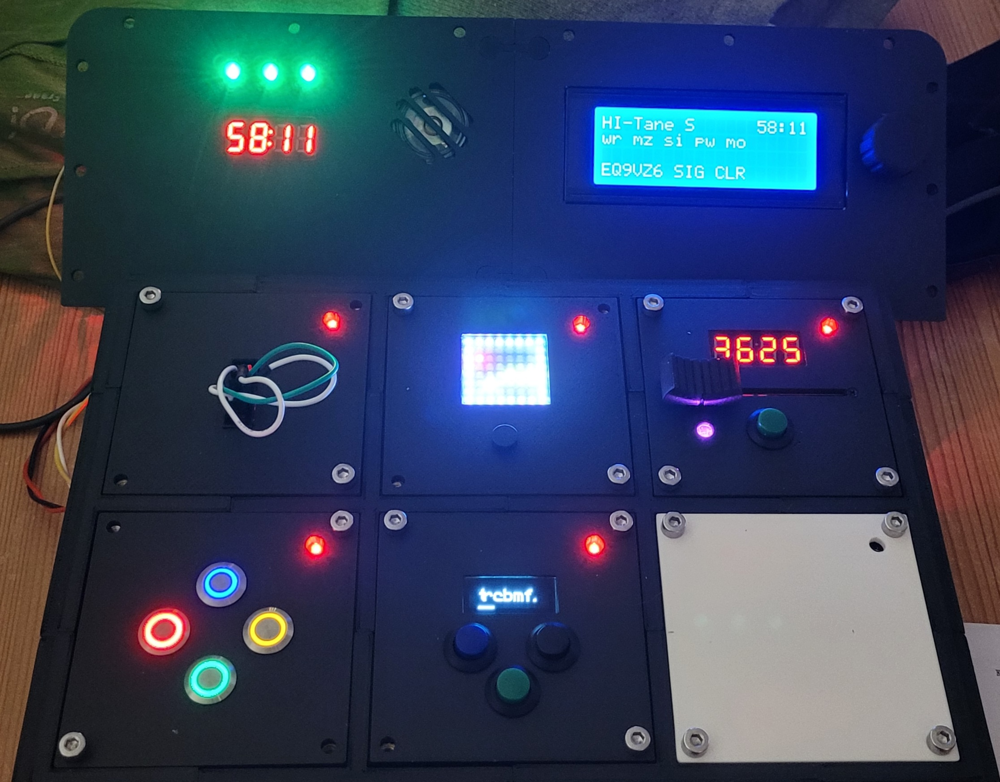

# hi-tane
hardware implementation of the game "keep talk and nobody explodes"

German only

Hier beschreibe ich die Entwicklung meiner Hardware variante des Spiels "keep talk and nobody explodes".
Ziel dieses Spiels ist eine "Bombenentschärfung".  Das ganze ist als Geburtstagsgeschenk an meine Frau gedacht. 

Eingebaut in einen kleinen Koffer. 

# Einleitung

*Der dumpfe Knall der zuschlagenden Tür hallte durch den kleinen verlassenen Lagerraum – Bob war eingeschlossen. Im schwachen Licht der flackernden Glühbirne sah er den Koffer mit der Bombe in der Mitte des Raums: ein wirres Geflecht aus Drähten, LEDs, Knöpfen und Displays und ein unheilvoll tickender Timer. Draußen durchsuchten Justus und Peter verstaubte Regale, bis sie endlich ein vergilbtes Handbuch fanden – die einzige Hoffnung, Bob lebend hier rauszubekommen. Ihre Stimmen knisterten über das Walkie-Talkie: „Bob, hör gut zu. Wir haben die Anleitung. Du musst uns genau beschreiben was du siehst und dann das tun, was wir sagen – und zwar schnell.“ Der Countdown läuft.*

# Hardware

## Basis

Das Spiel ist eigentlich im original ein Handy Spiel, ich habe aber dieses schöne Repository auf github gefunden, dass mir ein klein wenig als Stütze dient. https://heathbar.github.io/keep-talking/

Aufgebaut besteht das Spiel aus einem zentralen Controller, der die Steuerung der Module und die Zeitmessung übernimmt. Nebenher zählt er auch die Fehlversuche. Die einzelnen Module sind als eigenständige Einheiten aufgebaut, die über ein Bussystem mit dem zentralen Controller kommunizieren.

Folgende Module sind geplant:

- 6x6 Maze: finde den Weg zum Ausgang
- Wires: entferne die richtigen Kabel
- Simon says: ähnlich unserem Senso
- Password: finde das richtige Passwort
- Morse: Höre und Antworte
- Needy Gas: ein Modul was ab und zu mal etwas Aufmerksamkeit benötigt
- Symbols: Ordne die Symbole

## Kommunikation

Wie schon weiter oben beschrieben, alle Module und der Controller kommunizieren miteinander. Die Kommunikation basiert auf Nachrichten, die zwischen den Modulen ausgetauscht werden. Da alle Module sowohl untereinander wie auch zentral mit dem Controller kommunizieren müssen, bietet aich ein Bussystem an. Jeder Beteiligte kann über diesen Bus Nachrichten senden und empfangen. Soweit die Theorie. Zunächst einmal welche Nachrichten werden ausgetauscht:

- Heartbeat: Während des Spieles sendet der Controller regelmäßig eine Heartbeat Signal. Dieses enthält die aktuelle Zeit und die bereits registrierten Strikes.
- Ambientsettings: diese Message sendet der Controller allen Modulen. Sie enthält Einstellungen für das Spiel, wie z.B. Helligkeit, Farben usw.
- Gamesettings: ebenfalls eine Nachricht des Controllers an alle Module, enthält wichtige Spieleinstellungen: Schwierigkeitsgrad, Seriennummer, Tags, Batteries
- Initialisation: der Controller sendet an jedes Modul eine Nachricht zur Initialisierung. Das Modul antwortet darauf und der Controller kann nun eine Liste der Module erstellen.
- Error: falls bei einem Modul ein Fehler aufgetreten ist, kann es diesen über diese Meldung an den Controller übermitteln
- State: Das Modul übermittelt seinen neuen Status an den Controller: z.B. wenn das Rätsel gelöst wurde.
- Strike: Das Modul übermittelt hiermit, wenn eine fehlerhafte Eingabe erfolgt ist.
- Modulinit: Antwort des Modules auf die Initialisation Meldung
- Beep: Das Modul sendet diese Meldung an den Controller, wenn dieser einmal piepen soll.

Nachdem wir nun wissen, was so alles an Nachrichten ausgetauscht werden soll, ging es an die Auswahl des Busses. Zunächst habe ich es mit PJON versucht. 

PJON ist ein übergreifendes BUS-System, was mit einem PIN an dem Microcontroller auskommt. Die PINs der beteiligten Controller werden alle als Bus zusammen geschaltet, und diese Leitung an beiden Enden mit einem entsprechenden Widerstand terminiert. Der Hardwareaufwand ist sehr gering. Alles weitere passiert in der Software. Leider ist das auch schon das größte Problem. Wenn das Modul neben der eigentlichen Spielesteuerung auch noch durch die Kommunikation belastet wird, kommt es häufig dazu, dass die Kommunikation leidet. PJON ist super für Sensor oder Aktor Bussysteme, wo die Slaves nicht viel weiteres zu tun haben, als die Sensoren/Aktoren zu bedienen. Für meinen Anwendungsfall war die Fehlerrate allerdings zu hoch. 

Das nächste Protokoll, das ich versucht habe, ist RS485. Nachteile hier: die USART basierte serielle Schnittstelle wird auch für den Programmupload verwendet, was gerade beim Debugging sehr störend ist. Die Busarbitrierung ist bei RS485 schwierig. Man muss ein eigenes Halbduplex-Protokoll selber schreiben. Z.B. ein Token-Protokoll oder ein reines Master-Slave. Letztendlich war mir die Zeit dazu zu knapp. 

Letztendlich bin ich beim CAN-Bus gelandet. Vorteile:

- eigene Hardware für die komplette Busverwaltung 
- Messagefilter
- kleine Modulgröße
- einfache Programmierung
- eigenes Protokoll beschränkt sich auf die Messagedefinition und -verarbeitung.

Alle Module sowie der Controller benutzen für den Bus das gleiche CAN-Bus Modul mit dem MCP2515. Deswegen konnte die gesamte Kommunikation in einer eigenen Bibliothek ausgelagert werden.

## Gehäuse

Das ganze Spiel ist in einem Koffer eingebaut. Als Stromversorgung dient eine Powerbank. Der Controller mit den Strike LEDS, Lautsprecher, CoundDown Anzeige, 20x4 Display und Encoder ist im Deckel montiert.

Die Spielmodule sind in einem Rahmen im eigentlichen Fach montiert und können dort getauscht werden. Dadurch ist es möglich, verschiedenen Module zu verwenden. Derzeit hat der Rahmen platz für 6 Module. 

Alles zum Drucken findest du hier: https://www.tinkercad.com/dashboard/collections/iiqCBFKYnLP/3d

## Controller

Der Controller koordiniert verschiedenen Dinge des Spiels:

- Zeitmessung: nach dem Spielstart wird die Zeit (e.g. 60 min) mit einem Counter herunter gezählt. Ist die Zeit abgelaufen und die Bombe wurde nicht entschärft, ist das Spiel vorbei und verloren. Wurde die Bombe entschärft, wird die Restzeit angezeigt.
- Strike-Counter: man hat 3 Fehlversuche zur Entschärfung. Diese werden durch RGB LEDs  angezeigt
- Initialisierung: Zum Spielstart werden die verschiedenen Module in ihren Anfangszustand zurück gesetzt, es können verschiedenen Spielstufen, wie auch die Spielzeit und verschiedene weitere Parameter justiert werden. Basierend auf der Spielstufe und den Parametern, können die Module verschiedene Szenarien verwenden. Mögliche Parameter:
  - Seriennummer
  - Version
  - Anzahl der bereits vorhandenen Strikes
  - Anzahl der gelösten Rätsel
- Ermittlung der Module: der Controller ermittelt zunächst welche Module montiert sind. Anhand dieser Liste kann er entscheiden, wann das Spiel vorbei ist. 

Als Controller dient ein Arduino Nano mit folgender Peripherie:

- 20x4 Display mit Encoder zum Einstellen und Abrufen verschiedener Parameter
- Ein Lautsprecher als Beeper, später evtl. ein MP3 Modul
- ein 4-stelliges 7-Segment Display für die Spielzeitanzeige
- 3 RGB LEDs als Strikecounter
### Controller, die 2.
Es gibt eine 2. Version des Controllers. Diese arbeitet nur mit einem 128x64 OLED Display und den 3 Strike LEDs. Sämtliche weitere Angaben sind auf dem Display zu finden. Die OLED Version wird über einen Schalter in der `display.h` aktiviert. Der Controller 2 ist genau ein Modul groß. Hauptsächlich dient er der Entwicklung neuer Module. 

## 6x6 Maze: finde den Weg zum Ausgang

Basis ist eine 8x8 großes RGB LED Matrix. Ich verwende hier eine kleine Version mit ca. 35x35mm. Das Labyrinth wird nicht dargestellt, aber durch 2 feststehende gelbe Marker gekennzeichnet. In den Modi Einfach und Mittel wird nur ein 6x6 grosses Labyrinth benutzt. Dann leuchten die äußeren LEDs dauerhaft weiß. Der Start- und Zielpunkt werden durch einen weißen und einen roten Marker angezeigt. Diese Informationen übergibst du an PJ. Die müssen nun das richtige Labyrinth identifizieren und dir, Bob, erklären wie du vom Startpunkt zu dem Ziel kommst, ohne gegen eine Wand zu laufen.

## Wires: entferne die richtigen Kabel

Bob sieht vor sich ein paar Kabel auf einem Steckfeld. Welche und wie viele Kabel muss er nun entfernen, um die Bombe zu entschärfen? PJ versuchen anhand der Erklärung von Bob die richtigen Kabel zu finden.

## Simon says: ähnlich unserem Senso

In 3 Spielstufen geben die Taster eine Blinkreihenfolge ab. Bob muss diese an PJ übermitteln. Die können nun in der Anleitung die richtige Antwort darauf finden. Bob muss diese dann eingeben. Das Blöde ist nur, Bob hat nix zum Schreiben...

## Password: finde das richtige Passwort

Bob muss ein Passwort knacken. Anhand der möglichen Buchstaben pro Stelle ergibt sich nur 1 mögliches Passwort. Findet es.

## Keypad: Höre und Antworte

Beim Aktivieren ertönt eine Morsecode. Dieser muss dechiffriert werden und ergibt dann eine 5-stellige Pin. Bob muss diese dann über den Schieberegler eingeben.

## Symbols: Ordne die Symbole

Beim Start erscheinen 4 Symbole. Ordne diese wie im Manual.

# Aufbau

Ein Bild sagt mehr als 1000 Worte.

# Software

# Anhang

## Steckerbelegung und Farbzuordnung

Hier findest du für die PIN Zuordnungen zu den verschiedenen benutzten Steckverbindungen. 

### CAN Bus (5+2 Polig Dupont)

| PIN  | Signal | Kabel   |
| ---- | ------ | ------- |
| 1    | INT    | grau    |
| 2    | SCK    | gelb    |
| 3    | SI     | orange  |
| 4    | SO     | grün    |
| 5    | CS     | weiß    |
| 6    | GND    | schwarz |
| 7    | VCC    | rot     |

### Power/CAN (4 pol  B4B-XH-A )

| PIN  | Signal | Kabel   |
| ---- | ------ | ------- |
| 1    | GND    | schwarz |
| 2    | VCC    | rot     |
| 3    | CAN-LO | weiß    |
| 4    | CAN-HI | gelb    |

### RGB-LED (3-pol Dupont)

| PIN  | Signal | Kabel   |
| ---- | ------ | ------- |
| 1    | VCC    | rot     |
| 2    | GND    | schwarz |
| 3    | Din    | gelb    |

### External (RJ12 Telefonbuchse)

| PIN  | Signal | Kabel   |
| ---- | ------ | ------- |
| 1    | GND    | schwarz |
| 2    | GND    | schwarz |
| 3    | CAN-LO | weiß    |
| 4    | CAN-HI | gelb    |
| 5    | VCC    | rot     |
| 6    | VCC    | rot     |

