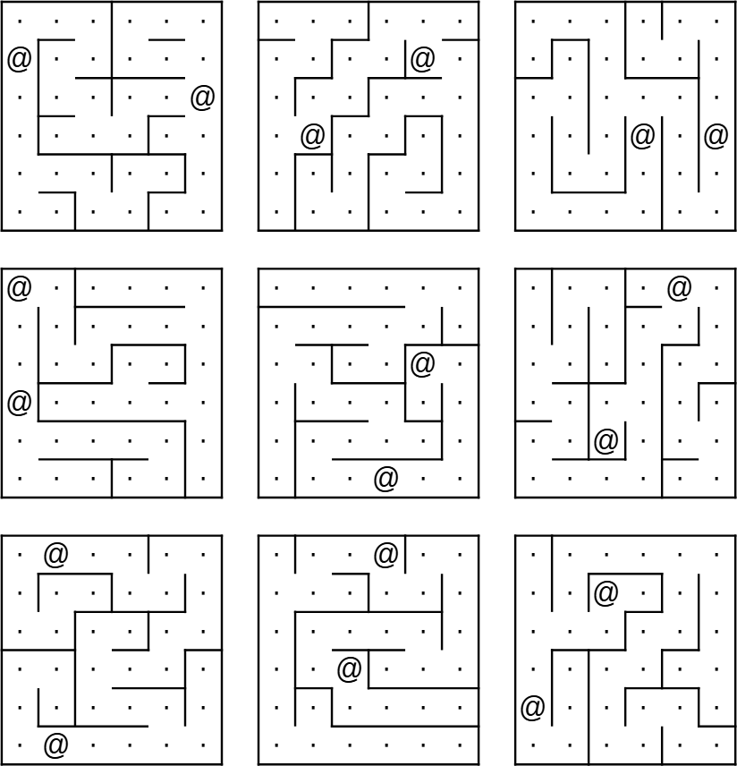

# Hardware KTane Module Maze

## Handbuch

### Labyrinth

*Hat jemand dieses Labyrinth aus einem Brettspiel geklaut?*

- Finde das korrekte Labyrinth anhand der gelben Markierungen.

- Der Entschärfer muss das weiße Licht mithilfe der Pfeiltasten zum roten Licht navigieren.

- Warnung: Überquere nicht die Linien. Diese Linien sind auf der Bombe unsichtbar!

Es gibt 2 verschiedene Labyrinth Typen. Für die Spielestufen SIMPLE und MEDIUM sind diese 6x6 groß, in der Spielstufe HARD 8x8.

