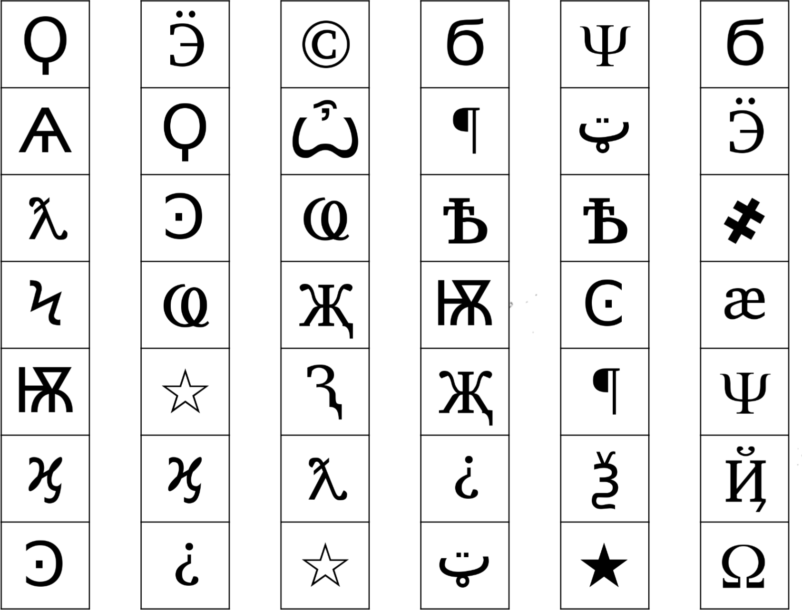

# Module Symbols

## Handbuch

## 

*Ich bin mir nicht sicher, was das für Symbole sind, aber ich denke, 
 sie haben etwas mit Okkultismus zu tun.*

Nur eine der untenstehenden Spalten enthält alle vier Symbole auf dem Tastenfeld. Drücke die vier Tasten in der Reihenfolge, in der sie von oben nach unten gelesen in dieser Spalte stehen.

